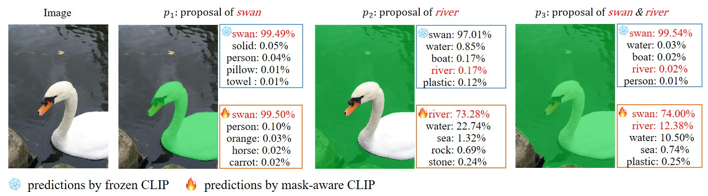

# Learning Mask-aware CLIP Representations for Zero-Shot Segmentation

[](https://paperswithcode.com/sota/open-vocabulary-semantic-segmentation-on-1?p=learning-mask-aware-clip-representations-for)
[](https://paperswithcode.com/sota/open-vocabulary-semantic-segmentation-on-2?p=learning-mask-aware-clip-representations-for)
[](https://paperswithcode.com/sota/open-vocabulary-semantic-segmentation-on-3?p=learning-mask-aware-clip-representations-for)
[](https://paperswithcode.com/sota/open-vocabulary-semantic-segmentation-on-7?p=learning-mask-aware-clip-representations-for)
[](https://paperswithcode.com/sota/open-vocabulary-semantic-segmentation-on-5?p=learning-mask-aware-clip-representations-for)

This is the official implementation of our conference paper : "[Learning Mask-aware CLIP Representations for Zero-Shot Segmentation](https://arxiv.org/abs/2310.00240)" (**NeurIPS 2023**).

:fire: News: Our paper [MAFT+](https://github.com/jiaosiyu1999/MAFT-Plus) is accepted to ECCV 2024!

<div align="center">


</div>

## Introduction

Recently, pre-trained vision-language models have been increasingly used to tackle the challenging zero-shot segmentation task. To maintain the CLIP's zero-shot transferability, previous practices favour to freeze CLIP during training. However, in the paper, we reveal that **CLIP is insensitive to different mask proposals and tends to produce similar predictions for various mask proposals of the same image**. This issue mainly relates to the fact that CLIP is trained with image-level supervision. To alleviate this issue, we propose a simple yet effective method, named Mask-aware Fine-tuning (MAFT). Specifically, Image-Proposals CLIP Encoder (IP-CLIP Encoder) is proposed to handle arbitrary numbers of image and mask proposals simultaneously. Then, mask-aware loss and self-distillation loss are designed to fine-tune IP-CLIP Encoder, ensuring CLIP is responsive to different mask proposals while not sacrificing transferability. In this way, mask-aware representations can be easily learned to make the true positives stand out. Notably, our solution can seamlessly plug into most existing methods without introducing any new parameters during the fine-tuning process. 


### Tab of Content
- [Installation](#1)
- [Data Preparation](#2)
- [Usage](#3)
  - [Training](#5)
  - [Evaluation](#4)
- [Cite](#6)

<span id="6"></span>

### Installation
1. Clone the repository
    ```
    git clone https://github.com/jiaosiyu1999/MAFT.git
    ```
2. Navigate to the project directory
    ```
    cd MAFT
    ```
3. Install the dependencies
    ```
    bash install.sh
    cd freeseg/modeling/heads/ops
    sh make.sh
    ```
   

<span id="2"></span>

### Data Preparation
See [Preparing Datasets for MAFT](datasets/README.md). The data should be organized like:
```
datasets/
  ade/
      ADEChallengeData2016/
        images/
        annotations_detectron2/
      ADE20K_2021_17_01/
        images/
        annotations_detectron2/
  coco/
        train2017/
        val2017/
        stuffthingmaps_detectron2/
  VOCdevkit/
     VOC2012/
        images_detectron2/
        annotations_ovs/      
    VOC2010/
        images/
        annotations_detectron2_ovs/
            pc59_val/
            pc459_val/      
```
<span id="3"></span>

### Usage


- #### Pretrained Weights

  |Model|A-847| A-150| PC-459| PC-59| PAS-20 |Weights|Logs|
  |-----|--|-|-|-|--|---|---|
  |[FreeSeg](https://github.com/bytedance/FreeSeg)|7.1|17.9|6.4|34.4|85.6|[freeseg_model.pt](https://drive.google.com/file/d/1vXelXYIBCpxJ3m4B-yDJSbZ1jiJZFjz7/view?usp=sharing) |-| 
  |MAFT-ViT-B|10.25|29.14|12.85|53.33|90.44 |[MAFT_Vitb.pt](https://drive.google.com/file/d/1J3QBMrU65pa8750q5hHiU7bTSsQ5gIAB/view?usp=sharing) |[Log](out/MAFT/log.txt)  | 
  |MAFT-ViT-L|12.12|32.05|15.68|58.01|92.14 |[MAFT_Vitl.pt](https://drive.google.com/file/d/1qMhc13JEFbNuNFylD4OCxzEHQaaQ4O8g/view?usp=sharing) |-  |
  

- #### Evaluation 

  <span id="4"></span>
  - evaluate trained model on validation sets of all datasets.
  ```
  python train_net.py --eval-only --config-file <CONFIG_FILE> --num-gpus <NUM_GPU> OUTPUT_DIR <OUTPUT_PATH> MODEL.WEIGHTS <TRAINED_MODEL_PATH>
  ```
   For example, evaluate our pre-trained model:
  ```
  # 1. Download MAFT-ViT-B.
  # 2. put it at `out/model.pt`.
  # 3. evaluation
    python train_net.py --config-file configs/coco-stuff-164k-156/eval.yaml --num-gpus 8 --eval-only 
  ```
<span id="5"></span>
- #### Training
1.  **step1** train an existing "froen CLIP" network, _e.g._, FreeSeg: 
```
    python train_net.py --config-file configs/coco-stuff-164k-156/mask2former_freeseg.yaml --num-gpus 4 
```

2.  **step2** Fine-tune CLIP Image Encoder with MAFT: (Note: the the step1 model should be load.)
```
   python train_net.py --config-file configs/coco-stuff-164k-156/mask2former_maft.yaml --num-gpus 4
```


<span id="6"></span>
### Cite 

If you find it helpful, you can cite our paper in your work.
```
@inproceedings{jiao2023learning,
  title={Learning Mask-aware CLIP Representations for Zero-Shot Segmentation},
  author={Jiao, Siyu and Wei, Yunchao and Wang, Yaowei and Zhao, Yao and Shi, Humphrey},
  booktitle={Thirty-seventh Conference on Neural Information Processing Systems},
  year={2023}
}
```
